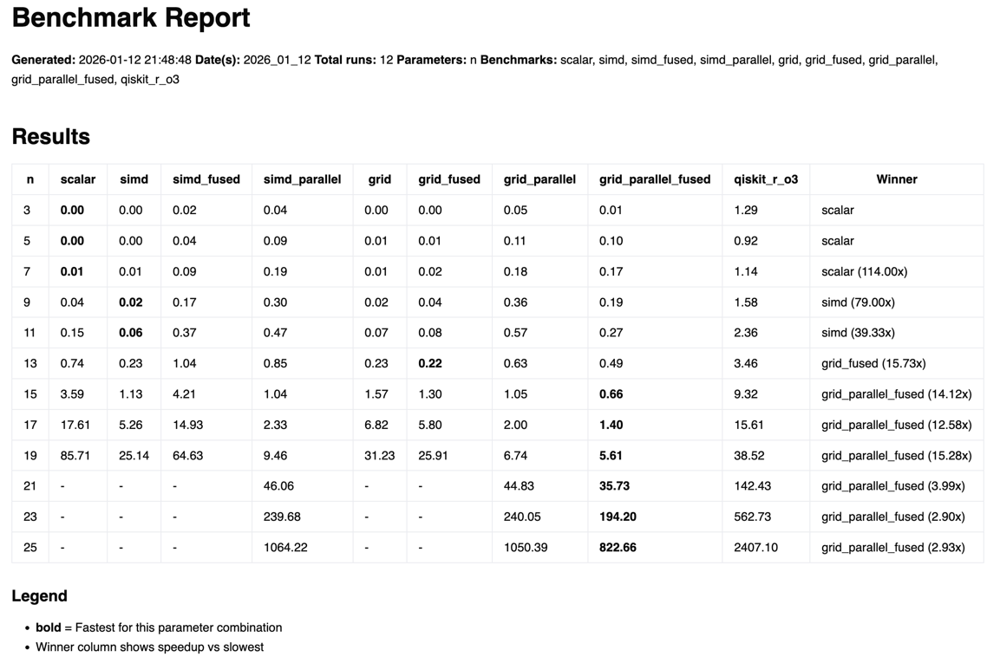
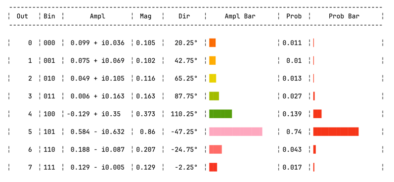
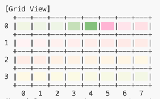

# Butterfly

Butterfly is a high-performance quantum circuit simulator written in Mojo.
It provides a fast statevector backend, multiple execution strategies
(scalar/SIMD/grid), and visualization utilities for inspecting quantum states
and circuit behavior. The codebase is optimized for local experimentation with
quantum algorithms, circuit fusion, and performance benchmarking.







## Highlights

- Multiple execution strategies: scalar, SIMD, parallel, grid, and fused grid.
- Circuit fusion for common gate pairs and grid row-local kernels.
- Rich state visualization: tables, 2D grids, and step-by-step animations.
- QASM 3 import (subset) for interoperability and quick experiments.
- Benchmarking harnesses for comparing strategies and kernels.

## Layout

- `butterfly/` core simulator, transforms, kernels, and algorithms.
- `tests/` examples and visualization tests.
- `benches/` performance benchmarks and result outputs.
- `tools/` utility CLI for building circuits interactively.
- `docs/` design notes and developer documentation.

## Quick start

Run a simple visualization test:

```
pixi run mojo run -I . tests/test_visualize_grid_state.mojo
```

Animate a value-encoding circuit:

```
pixi run mojo run -I . tests/test_animate_value_encoding.mojo
```

Interactive circuit CLI:

```
pixi run mojo run -I . tools/circuit_cli.mojo -- --prompt
```

## Examples

Visualize function encoding:

```
pixi run mojo run -I . tests/test_visualize_function_encoding.mojo
```

Identity function grid view:

```
pixi run mojo run -I . tests/test_visualize_function_identity.mojo
```

## Notes

- Visualization uses ANSI colors; terminal support varies.
- Some interactive stepping uses Python `termios` for key input.

